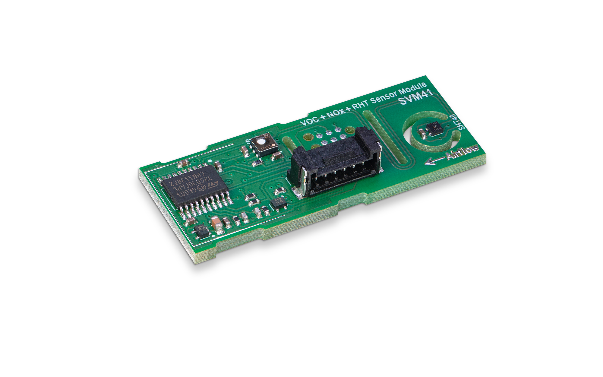
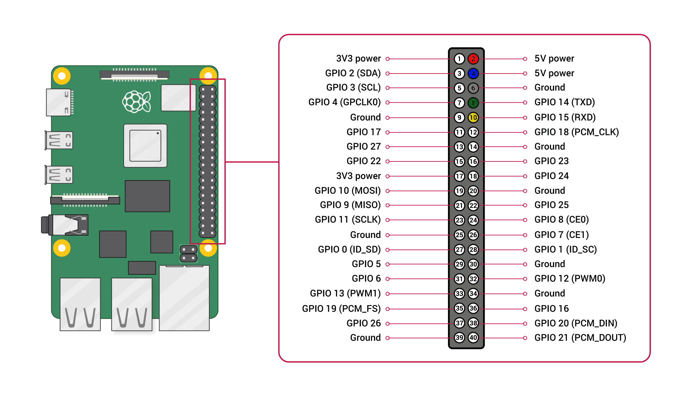

# Sensirion Raspberry Pi UART SVM41 Driver

This document explains how to set up a SVM41 sensor to run on a Raspberry Pi using the provided code.



Click [here](https://sensirion.com/my-sgp-ek) to learn more about the Sensirion SVM41 sensor.

## Connect the sensor

<details><summary>Connecting the Sensor over USB</summary>
<p>
This is the recommended way to connect your sensor. 
Plug the provided USB cable into your Raspberry Pi and sensor.
</p></details>


<details><summary>Connecting the Sensor over UART Pins</summary>
<p>

Use the following pins to connect your SVM41 to your Raspberry Pi:


| *Pin SVM41* | *Cable Color* | *Name* | *Pin Raspberry Pi* | *Description* |*Description* |
|-------------|---------------|--------|--------------------|---------------|---------------|
| 1 | red |VDD |Pin 2 (VDD)| Supply Voltage | 3.3 or 5V | 
| 2 | black |GND |Pin 6 (GND) | Ground | | 
| 3 | green |RX | Pin 8 (TXD) | UART communication | | 
| 4 | yellow |TX | Pin 10 (RXD) | UART communication | | 
| 5 | blue |SEL | Pin 4 (VDD) | Interface select | Leave floating or pull to VDD to select UART | 
| 6 | purple |NC | - | Do not connect |



> **Note:** Make sure to [configure your hardware serial interface](https://www.raspberrypi.com/documentation/computers/configuration.html#disabling-the-linux-serial-console) on your Raspberry Pi.

> **Note:** Make sure to connect serial pins as cross-over (RX pin of sensor -> TX on Raspberry Pi; TX pin of sensor -> RX pin of Raspberry Pi)


</p></details>

## Quick start example

- [Install the Raspberry Pi OS on to your Raspberry Pi](https://projects.raspberrypi.org/en/projects/raspberry-pi-setting-up)
- Connect the SVM41 sensor as explained in the [section above](#connect-the-sensor)
- Download the SVM41 driver from [Github](https://github.com/Sensirion/raspberry-pi-uart-svm41) and extract the `.zip`
  on your Raspberry Pi

    - Compile the driver
        1. Open a [terminal](https://projects.raspberrypi.org/en/projects/raspberry-pi-using/8)
        2. Navigate to the driver directory. E.g. `cd ~/raspberry-pi-uart-svm41`
        3. Run the `make` command to compile the driver

           Output:
           ```
           rm -f svm41_uart_example_usage
           cc -Os -Wall -fstrict-aliasing -Wstrict-aliasing=1 -Wsign-conversion -fPIC -I. -o svm41_uart_example_usage svm41_uart.h svm41_uart.c sensirion_uart_hal.h sensirion_shdlc.h sensirion_shdlc.c \
               sensirion_uart_hal.c sensirion_config.h sensirion_common.h sensirion_common.c svm41_uart_example_usage.c

           ```
- Test your connected sensor
    - Run `./svm41_uart_example_usage` in the same directory you used to compile the driver. You should see the
      measurement values in the console.

## Contributing

**Contributions are welcome!**

We develop and test this driver using our company internal tools (version control, continuous integration, code review
etc.) and automatically synchronize the master branch with GitHub. But this doesn't mean that we don't respond to issues
or don't accept pull requests on GitHub. In fact, you're very welcome to open issues or create pull requests :)

This Sensirion library uses
[`clang-format`](https://releases.llvm.org/download.html) to standardize the formatting of all our `.c` and `.h` files.
Make sure your contributions are formatted accordingly:

The `-i` flag will apply the format changes to the files listed.

```bash
clang-format -i *.c *.h
```

Note that differences from this formatting will result in a failed build until they are fixed.

## License

See [LICENSE](LICENSE).
