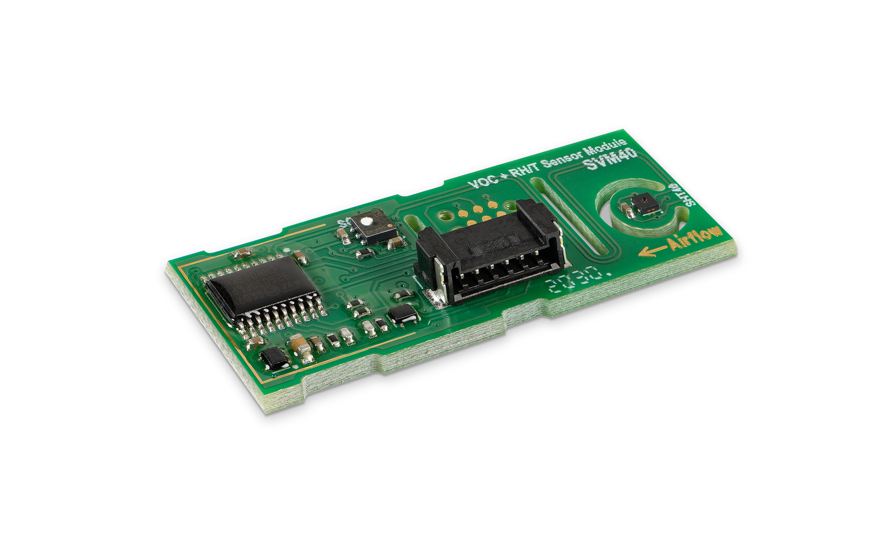
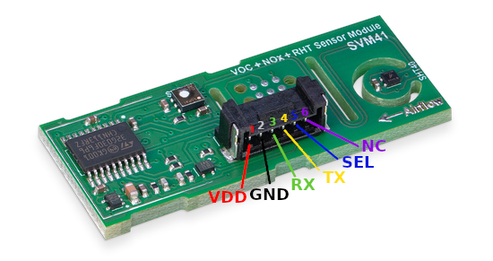

# Sensirion Raspberry Pi UART SVM4X Driver

The repository provides a driver for setting up a SVM4X sensor to run on a Raspberry Pi over UART using the SHDLC protocol. 



Click [here](https://www.sensirion.com/my-sgp-ek/) to learn more about the Sensirion SVM4X sensor.


The SVM4x evaluation kit covers evaluation of the SGP40 and SGP41 sensors.


## Connect the sensor

<details><summary>Connecting the Sensor over USB</summary>
<p>
This is the recommended way to connect your sensor. 
Plug the provided USB cable into your Raspberry Pi and sensor.
</p></details>


<details><summary>Connecting the Sensor over UART Pins</summary>
<p>

Use the following pins to connect your SVM4X to your Raspberry Pi:



| *Pin SVM4X* | *Cable Color* | *Name* | *Pin Raspberry Pi* | *Description*  | *Comments* |
|---|---|:---:|---|---|---|
| 1 | red | VDD | Pin 2 | Supply Voltage | 3.3 or 5V |
| 2 | black | GND | Pin 6 | Ground |  |
| 3 | green | RX | Pin 8 | UART: Transmission pin for communication |  |
| 4 | yellow | TX | Pin 10 | UART: Receiving pin for communication |  |
| 5 | blue | SEL | Pin 4 | Interface select | Leave floating or pull to VDD to select UART |


> **Note:** Make sure to [configure your hardware serial interface](https://www.raspberrypi.com/documentation/computers/configuration.html#disabling-the-linux-serial-console) on your Raspberry Pi.

> **Note:** Make sure to connect serial pins as cross-over (RX pin of sensor -> TX on Raspberry Pi; TX pin of sensor -> RX pin of Raspberry Pi)

</p></details>

## Quick start example

- [Install the Raspberry Pi OS on to your Raspberry Pi](https://projects.raspberrypi.org/en/projects/raspberry-pi-setting-up)
- Download the SVM4X driver from [Github](https://github.com/Sensirion/raspberry-pi-uart-svm4x) and extract the `.zip`
  on your Raspberry Pi
- Connect the SVM4X sensor as explained in the [section above](#connect-the-sensor)
- Check that the correct serial port is set in the define in `sensirion_uart_portdescriptor.h`
   - For connection over USB (in case you have other devices connected check the USB number)

     `#define SERIAL_0 "/dev/ttyUSB0"`

   - For connection over UART Pins 

     `#define SERIAL_0 "/dev/serial0"`

- Compile the driver
    1. Open a [terminal](https://projects.raspberrypi.org/en/projects/raspberry-pi-using/8)
    2. Navigate to the driver directory. E.g. `cd ~/raspberry-pi-uart-svm4x`
    3. Navigate to the subdirectory example-usage.
    4. Run the `make` command to compile the driver

       Output:
       ```
       rm -f svm4x_uart_example_usage
       cc -Os -Wall -fstrict-aliasing -Wstrict-aliasing=1 -Wsign-conversion -fPIC -I. -o svm4x_uart_example_usage svm4x_uart.h svm4x_uart.c sensirion_uart_hal.h sensirion_shdlc.h sensirion_shdlc.c \ 
           sensirion_uart_hal.c sensirion_config.h sensirion_common.h sensirion_common.c svm4x_uart_example_usage.c
       ```
- Test your connected sensor
    - Run `./svm4x_uart_example_usage` in the same directory you used to compile the driver. You should see the
      measurement values in the console.

## Troubleshooting

### Building driver failed

If the execution of `make` in the compilation step 3 fails with something like

```bash
 make: command not found
```

your RaspberryPi likely does not have the build tools installed. Proceed as follows:

```
$ sudo apt-get update
$ sudo apt-get upgrade
$ sudo apt-get install build-essential
```


## Contributing

**Contributions are welcome!**

We develop and test this driver using our company internal tools (version
control, continuous integration, code review etc.) and automatically
synchronize the master branch with GitHub. But this doesn't mean that we don't
respond to issues or don't accept pull requests on GitHub. In fact, you're very
welcome to open issues or create pull requests :)

This Sensirion library uses
[`clang-format`](https://releases.llvm.org/download.html) to standardize the
formatting of all our `.c` and `.h` files. Make sure your contributions are
formatted accordingly:

The `-i` flag will apply the format changes to the files listed.

```bash
clang-format -i *.c *.h
```

Note that differences from this formatting will result in a failed build until
they are fixed.


## License

See [LICENSE](LICENSE).